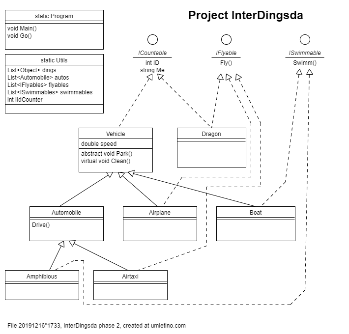
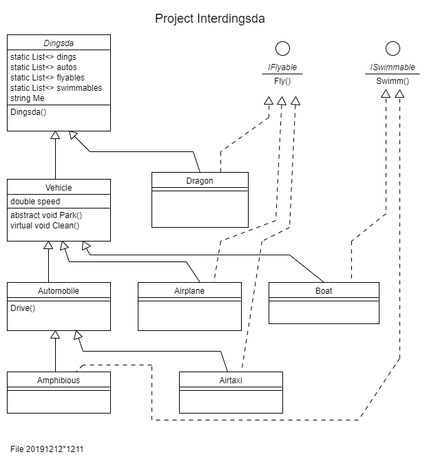

# Additional notes

## 1. Todos

[todo 20191218°1631]
Rename interface 'ICountable' to 'IRegisterable'.

Introduce LINQ demo [todo 20191218°1313]

Not all methods are used so far, e.g. Park(), Clean(). Use them.
[todo 20191212°1923]

---

*[todo : Check the correctness of the following listing.]*

## 2. Development Phases or Tags

### 2.1 Development Phase 3 2019-Dec-18

Introduces sequences to demonstrate **IEnumerable**

This is from when the solution resides on GitHub

### 2.2 Development Phase 2

This are Tags ~~'Last-multi-phase-folders' 20191217°1000
and ~~'interdings-v0-3-0' 20191217°1022

Remove the artificial object 'Dingsda' class and replace it by the .NET native Object class.
The steps are :

- The original file/class 'Dingsda' war renamed to **static** file/class 'Utils'.
This was done, because that file contains the static various lists we already had,
and which continue to exist exactly as they are.

- Replace 'List<Dings> dings' by 'List<**Object**> dings'

- To retain the object's ID and Me property, we introduced interface **ICountable**

To inspect the changes of the transformation, see the GIT logs with
comment 'Adjust syntax' and 'Restore functionality'.

### 2.3 Development Phase 1

This is Tag 'InterDings.v011' 20191216°1441

Initial version.

As the top parent class functions the dedicated class 'Dingsda', which is
only introduced as quick'n'dirty helper to avoid dealing dealing with the
Object class itself. How to use the Object class, we will demonstrate in
the next version.

---

*[file 20191216°1431]* ܀Ω
