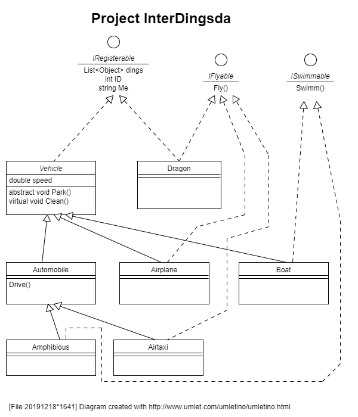

# DingsdaDemos Solution &nbsp; v0.3.0x..

## 1. Synopsis

**Platform** : C-Sharp, Visual Studio 2017, .NET 4.6.1

**Slogan** : Understand some baffling C# features

**Summary** : This solution hosts some project to demonstrate
some non-trivial C# features like interfaces or IEnumerator.

**License** : The MIT-License

**Authors** : Norbert C. Maier and contributors

**Copyright** : Norbert C. Maier and contributors

## 2. Projects

- [InterDings](./InterDings/readme.md).
The main project, this contains also the class hierarchy
which is used by the other projects

- [IEnumablDings](./IEnumablDings/readme.md).
This contains a class which implements the IEnumerable<> interface
and shows how to use it.

## 3. The story

The class hierarchy created in the InterDings project can be used
from the other projects as well. The story goes like follows.

### 3.1 Actors

The main actor is the **Vehicle**.
The Vehicle is abstract, because in the real world, you find only concrete incarnations of them.

The **Automobile** is a Vehicle which can drive.
The driving ability is established by method Drive(), which can be inherited.

The **Airplane** is a Vehicle which can fly.
But we do not establish the flying ability by a method Fly() here,
because also other very different objects can fly, e.g. the dragon.
This is why Fly() is introduced by interface **IFlyable**.

The **Boat** is of course a Vehicle.
The swimming ability is, like with flying, not established by a method for inheritance
but by interface **ISwimmable**.

The **Amphibious** is a Vehicle. Since it can drive, it can be inherited from Automobile.
This uses up the inheritance, and the swimming capability is introduce by interface **ISwimmable**.

The **Airtaxi** is also Vehicle. It inherits it's driving capability from the Automobile,
and the flying capability is introduced by interface IFlyable.

The **Dragon** has nothing to do with the vehicles at all,
just it can also fly with interface IFlyable.

The **IFlyable** interface provides some objects the flying capability.

The **ISwimmable** interface provides some objects the swimming capability.

The **ICountable** interface provides all classes in the game some common
addressing properties, so we can have a list of just all existing things.

### 4.2 Points of Interest

The ICountable interface could be replaced by extension methods on the Object class.
But we shyed away from this move, because we do not want touch the .NET core functionality.

. . .

---

*[file 20191216°1717] [solution 20191212°0011]* ܀Ω
