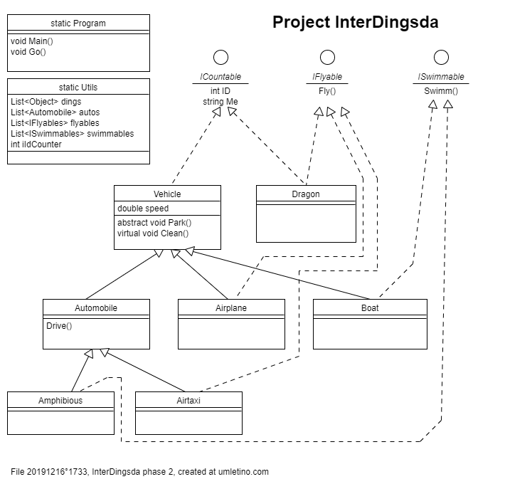

# DingsdaDemos v0.3.0x

Project **InterDingsda** is so far the only project in this repository.

## 1. Synopsis

**Platform** : C-Sharp, Visual Studio 2017, .NET 4.6.1

**Slogan** : Understand interfaces

**Summary** : This project demonstrates interfaces and their paraphernalia
• abstract methods • virtual methods • type casting • IEnumerable

**License** : The MIT-License

**Authors** : Norbert C. Maier, ...

**Copyright** : None

## 2. The story

### 2.1 Actors

The main actor is the **Vehicle**.
The Vehicle is abstract, because in the real world, you find only concrete incarnations of them.

The **Automobile** is a Vehicle which can drive.
The driving ability is established by method Drive(), which can be inherited.

The **Airplane** is a Vehicle which can fly.
But we do not establish the flying ability by a method Fly() here,
because also other very different objects can fly, e.g. the dragon.
This is why Fly() is introduced by interface **IFlyable**.

The **Boat** is of course a Vehicle.
The swimming ability is, like with flying, not established by a method for inheritance
but by interface **ISwimmable**.

The **Amphibious** is a Vehicle. Since it can drive, it can be inherited from Automobile.
This uses up the inheritance, and the swimming capability is introduce by interface **ISwimmable**.

The **Airtaxi** is also Vehicle. It inherits it's driving capability from the Automobile,
and the flying capability is introduced by interface IFlyable.

The **Dragon** has nothing to do with the vehicles at all,
just it can also fly with interface IFlyable.

The **IFlyable** interface provides some objects the flying capability.

The **ISwimmable** interface provides some objects the swimming capability.

The **ICountable** interface provides all classes in the game some common
addressing properties, so we can have a list of just all existing things.

### 2.2 Points of Interest

The ICountable interface could be replaced by extension methods on the Object class.
But we shyed away from this move, because we do not want touch the .NET core functionality.

. . .

. . .

. . .

## 3. Development Phases

#### Phase 4 (planned)

Introduces sequences to demonstrate **LINQ**

. . .

#### Phase 3 (planned)

Introduces sequences to demonstrate **IEnumerable**

. . .

#### Phase 2

Remove the artificial object 'Dingsda' class and replace it by the .NET native Object class.
The steps are :

- The original file/class 'Dingsda' war renamed to **static** file/class 'Utils'.
This was done, because that file contains the static various lists we already had,
and which continue to exist exactly as they are.

- Replace 'List<Dings> dings' by 'List<**Object**> dings'

- To retain the object's ID and Me property, we introduced interface **ICountable**

To inspect the changes of the transformation, see the GIT logs with
comment 'Adjust syntax' and 'Restore functionality'.

#### Phase 1

Initial version.

As the top parent class functions the dedicated class 'Dingsda', which is
only introduced as quick'n'dirty helper to avoid dealing dealing with the
Object class itself. How to use the Object class, we will demonstrate in
the next version.

## 4. Todos

Not all methods are use so far, e.g. Park(), Clean(). Use them.
[todo 20191212°1923]

---
 [file 20191216°1717][project 20191212°0011]܀Ω
